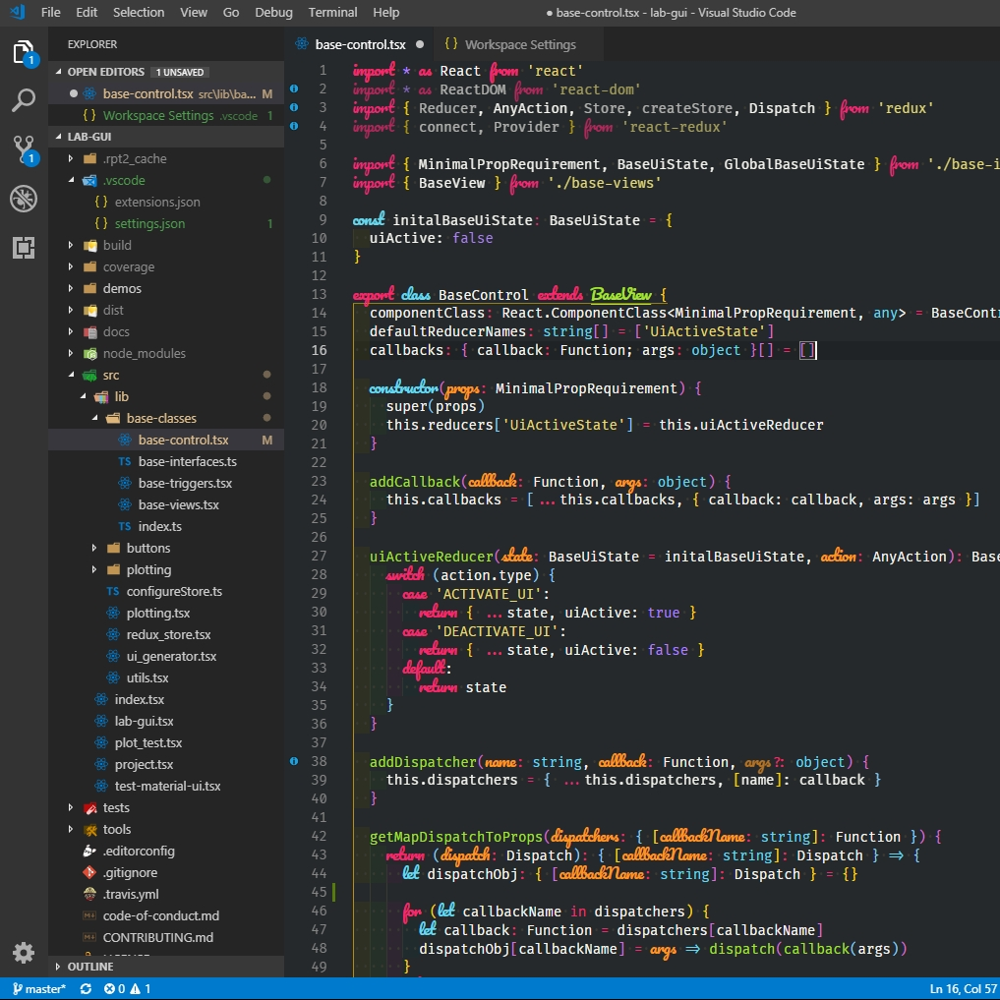

# vscode-configs
My VsCode config for different tasks, with the extensions only installed for the appropriate task.

The coursive font is [Firicico](https://github.com/kosimst/Firicico), if you dont like it and just want the cool looking operators, install [Fira Code](https://github.com/tonsky/FiraCode).
If you have problems with Firicico on Windows [this guide](https://github.com/kosimst/Firicico/issues/19) will help you.

## Usage

Copy the `.vscode` folder from one of the subfolders to you project, run `start_vscode.bat`/`start_vscode.sh`, open your project folder and install all recommentet extensions.

