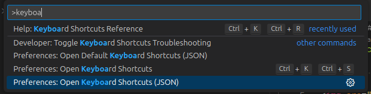

# vscode-configs

My VsCode config for different tasks, with the extensions only installed for the appropriate task.

The cursive font is [Firicico](https://github.com/kosimst/Firicico), if you don't like it and just want the cool looking operators, install [Fira Code](https://github.com/tonsky/FiraCode).

**Note:**

Since the [current master Firicico is broken](https://github.com/kosimst/Firicico/issues/19) I added a script to download and fix it. Just run `bash download_font.sh` in a terminal, which supports git and Firicico will be downloaded to the subfolder `Firicico`.

## Usage

### Project settings

Copy the `.vscode` folder from one of the subfolders to you project, run `start_vscode.bat`/`start_vscode.sh`, open your project folder and install all recommended extensions.

### Keybindings

Open the command pallet in vscode (`ctrl+shift+p`), type `keyboard` and select "Preferences: Open Keyboard Shortcuts (JSON)".

Copy the content of `keybindings.json` into your keybinding.
Enjoy having consistent keybindings on windows and linux.
